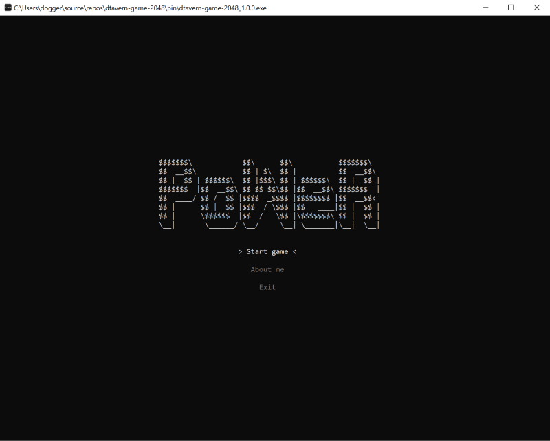
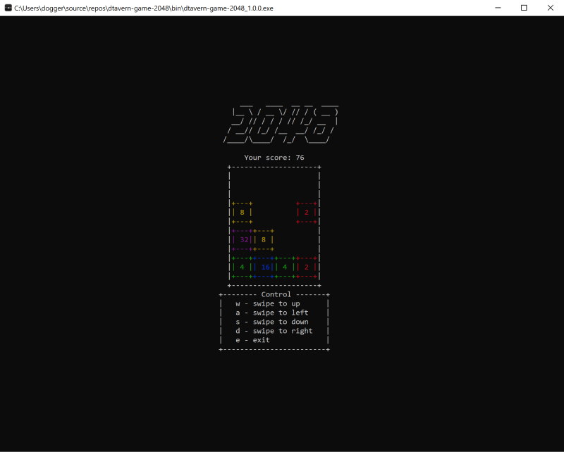
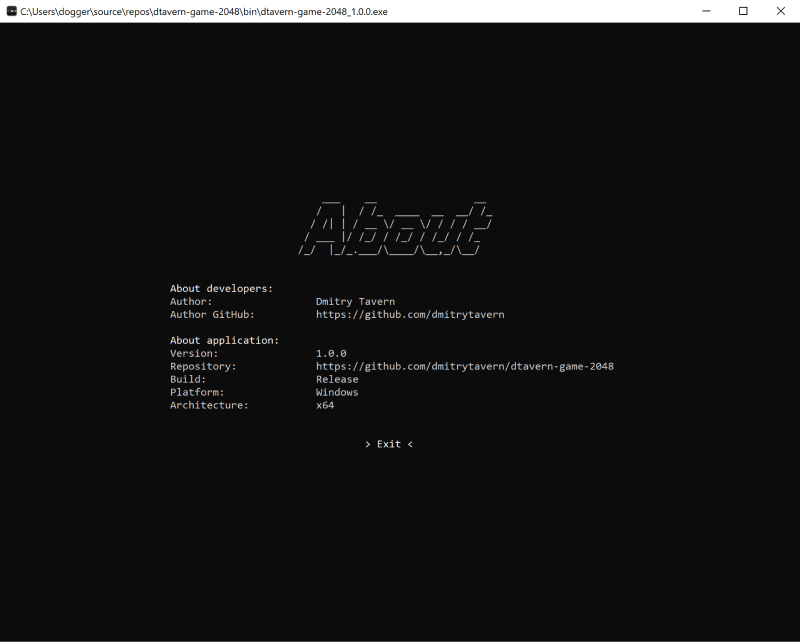
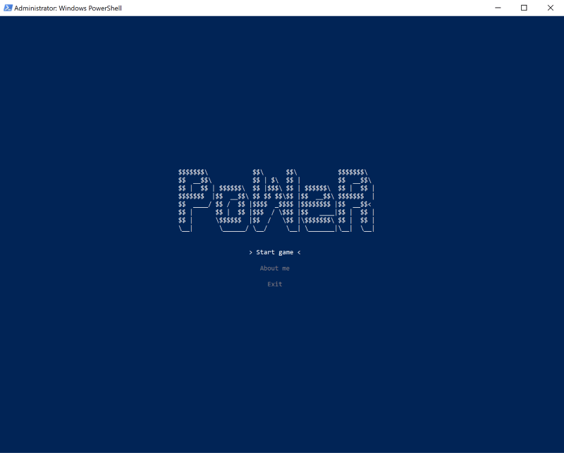
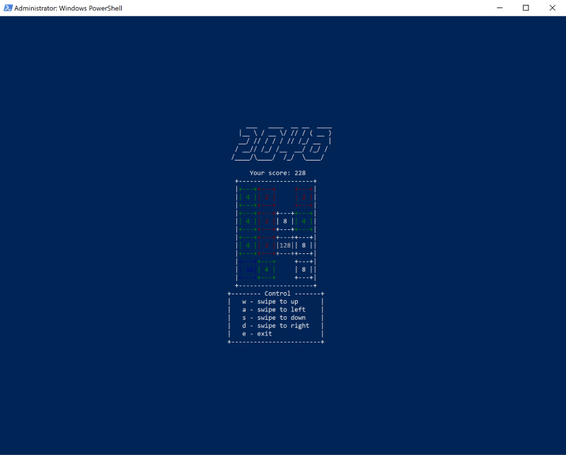
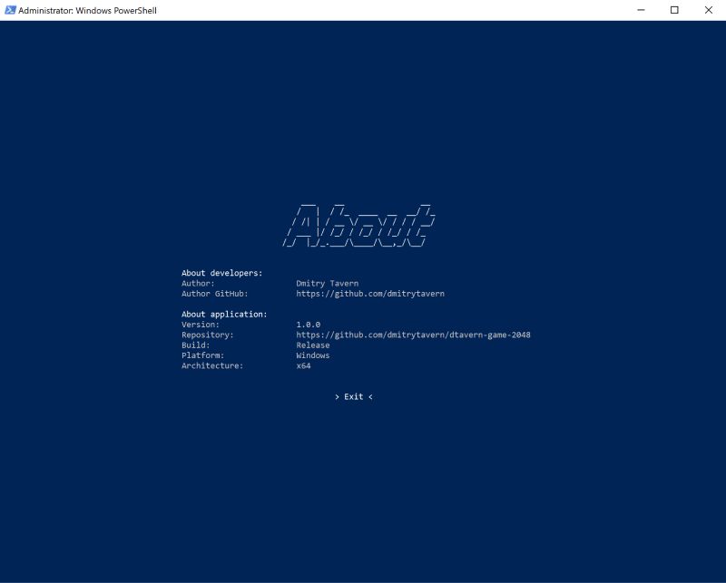

[< Back to docs](./readme.md)

# **Game screenshots**

Table of Contents:
- [Windows Command Line](#windows-command-line)
- [Windows Power shell](#windows-power-shell)
- [Linux KDE with dark terminal](#linux-kde-with-dark-terminal)
- [Linux Ubuntu with default terminal](#linux-ubuntu-with-default-terminal)

## **Windows Command Line**

  
  
  
  

## **Windows Power shell**

  
  
  
  

## **Linux KDE with dark terminal**

  
  
  
  

## **Linux Ubuntu with default terminal**

  
  
  
  

