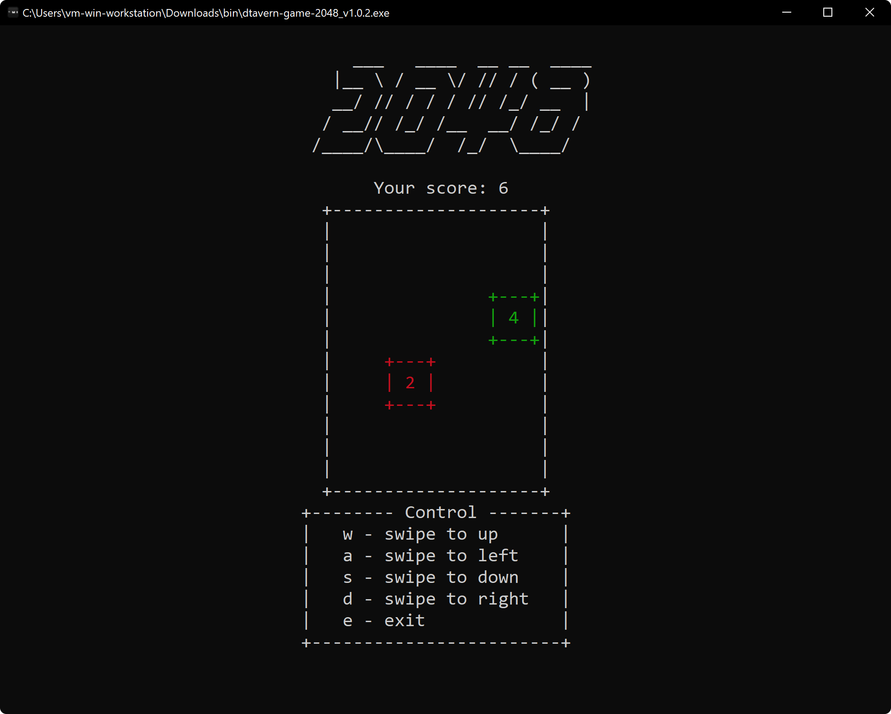

[< Back to docs](./readme.md)

# **Game screenshots**

Table of Contents:

- [Windows 10](#windows-10)
- [Linux KDE with dark terminal](#linux-kde-with-dark-terminal-v100)
- [Linux Ubuntu with default terminal](#linux-ubuntu-with-default-terminal-v100)

## **Windows 10**

  
  
  
  
  
  
  
  

## **Linux KDE with dark terminal (v1.0.0)**

  
  
  
  

## **Linux Ubuntu with default terminal (v1.0.0)**

  
  
  
  

