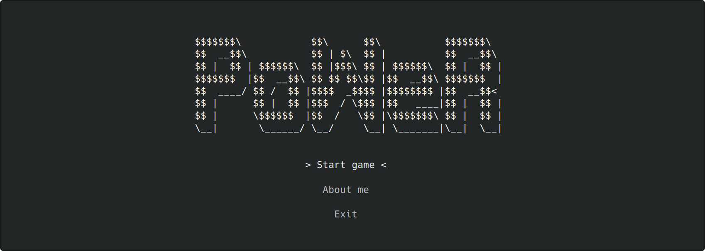

# **DTavern Game 2048**



**DTavern Game 2048** is a simple 2048 game in your terminal. It is my first game and the first project on C++ only with standard libraries. See more [screenshots of the game](docs/preview-screenshots.md).

## **Features**
  - Available on Windows and Linux
  - Without external libraries
  - CMake
  - CTest with catch2 integration

## **Download**

  -  **Windows (7, 8, 10):**
    - [dtavern-game-2048_v1.0.0.exe](https://github.com/dmitrytavern/2048/releases/download/v1.0.0/dtavern-game-2048_v1.0.0.exe) (x64 bit)
    - [dtavern-game-2048_x86_v1.0.0.exe](https://github.com/dmitrytavern/2048/releases/download/v1.0.0/dtavern-game-2048_x86_v1.0.0.exe) (x32 bit)

    After downloading, just run it as a standard exe file.

  -  **Linux:**
    - [dtavern-game-2048_v1.0.0](https://github.com/dmitrytavern/2048/releases/download/v1.0.0/dtavern-game-2048_v1.0.0) (x64 bit)
    - [dtavern-game-2048_x86_v1.0.0](https://github.com/dmitrytavern/2048/releases/download/v1.0.0/dtavern-game-2048_x86_v1.0.0) (x32 bit)

    After downloading, run it in the terminal:
    ```
    ./dtavern-game-2048_v1.0.0
    ```

    Note: for linux, you need set rights for execution:
    ```
    sudo chmod +x dtavern-game-2048_v1.0.0
    ```

  - **MacOS:** not available
  - **Self compile:** see [documentation by compilation](docs/project-compilation.md)

## **Documentation**

- [Screenshots](docs/preview-screenshots.md) - see more screenshots from the game in different terminals
- [How to compile](docs/project-compilation.md) - how to compile the game on different os
- [Game structure](docs/project-structure.md) - about directories in the game
- [Game architecture](docs/project-architecture.md) - how to write code for this game
- [Game libraries](docs/project-libraries.md) - about game libraries

## **Frequently Asked Questions**

No one has actually asked these questions, but you might be interested:

### **Q: Is it safe?**
**Answer:** Yes. I have not used external libraries and compiled programs on official clear Windows 10 (VMWare Player) in official Visual Studio C++ 2022. For Linux, I use Arch Linux with Visual Studio Code. If you do not trust suspicious links, you can compile this program for your system on one's own. See the [documentation by compilation](docs/project-compilation.md).

### **Q: What is the purpose of the game?**
**Answer:** Firstly, gaining new knowledge in the field of C++ programming. Before I worked only on JS/TS. Secondly, for fun. This project arose spontaneously when I did not even think about the ultimate goal. You can see it in early commits.

### **Q: Why this game is not available on MacOS??**
**Answer:** I have no production from Apple. CI - this is a possible solution, but I don't like that I can't test it on a real machine

### **Q: Is there anything to develop??**
**Answer:** Of course! Can add selecting language, can add game settings, can add game achievements, can write more tests, and include debuggers. Also, can add support for MacOS with CI/CD and arm architecture for Linux and Windows. Maybe in the future, can add the ncurses library as GUI lib, but that's a completely different story ;)

### **Q: What is "PoWeR" on main screen?**
**Answer:** In honor of Power form the Chainsaw Man. After two months of absence from GitHub, my project appeared almost as epic as Power appeared in the second episode.

## **License**
MIT - check repo files

Copyright (c) 2022-present, Dmitry Tavern
